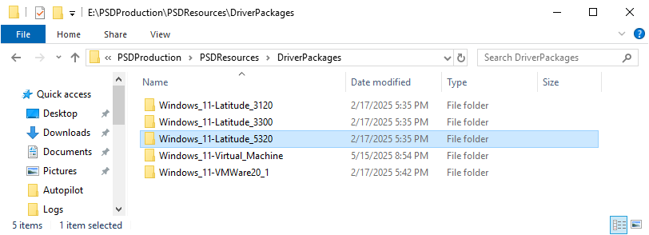

# Operations Guide

This guid is for standard operational guide when using PSD. For the latest updates refer to the [PowerShell Deployment - Latest Release Setup Guide.md](./PowerShell%20Deployment%20-%20Latest%20Release%20Setup%20Guide.md)

## Introduction

PSD enabled deployments works the same as standard MDT Lite Touch Deployments. They can be initiated via PXE, or via Boot Media (ISO/USB). Here follows a list of common operations actions for the PSD solution

### Import Operating Systems

Within MDT Deployment workbench, on the newly created PSD Deployment share, import/create/copy any desired Operating Systems. Follow MDT-provided instructions and techniques.

>PRO TIP: You can copy Operating Systems from other MDT deployment shares within the Deployment Workbench.

### Create PSD Task Sequence

You **MUST** create a new Task Sequence from the PSD Templates within the workbench. PSD will fail otherwise. Do not attempt to clone/copy/import or otherwise work around this step. Some steps are required for PSD functionality. Do not delete any of the PSD task sequence steps - you may disable steps in the PSD Template task sequences if you choose.

>PRO TIP: If you upgrade PSD version at a later date, **expect** to recreate your task sequences from the new PSD templates.


### Create Applications

Within MDT Deployment workbench, on the newly created PSD Deployment share, import/create/copy any desired Applications. Follow MDT-provided instructions and techniques. Make note of application's unique GUIDs for use automating application installation with CustomSettings.ini.

>PRO TIP: You can copy Applications from other MDT deployment shares within the Deployment Workbench.

>BUG: Be sure to add a dummy app to `customsettings.ini`. THere is a glitch if you want to use application selection in the new PSDWizard

### Import/Add Drivers

The PSD platform leverages a folder structure for driver packages inside the DeploymentShare\PSDResources\DriverPackages folder. This structure is depending on the DriverPath, GenericDriverPath, and FallBackDriverPath variables. 

#### Make and Model Drivers
Having Make and Model driver packages per OS Family is also called Total Control method...

Here is an example for Windows 11 and a Dell Latitude 5320, and the default DriverPath variable (Windows 11\%ModelAlias%)

Step 1: Create a folder that matches the DriverPath variable, OS Family and Hardware Model alias in this case. Windows_11_x64-Latitude_5320 

Please note that the "\" character is replaced with "-", and space is using "_", see the following examples



Step 2: Add either a ZIP or WIM file with the drivers for your hardware model to the created folder. We recommend naming the file short and sweet, without any spaces. For example DriverPackage.wim

Note: We recommend having only one file per folder, but technically PSD will inject drivers from multiple files if they exist.

#### Generic Drivers
Generic Drivers is a driver package that you would like to install regardless of model, for example a printer or smart card driver.

The default path for the GenericDriverPath vaiable is Windows 11\Generic, meaning you place the drivers in the Windows_11-Generic folder.


#### Fallback Drivers
Fallback Drivers is a driver package that you would like to install if there is no make\model package available.

The default path for the FallBackDriverPath vaiable is Windows 11\FallBack, meaning you place the drivers in the Windows_11-Fallback folder. A good example is commonly used network, storage or video drivers. This way you allow the OS to become somewhat functional and additional can be added later.

#### Helper Scripts
If you already have an existing MDT deployment share with drivers, we have created helper scripts that can convert those drivers into either ZIP or WIM files. 

To "convert" an existing Out-Of-Box Drivers folder in a MDT Deployment workbench run the New-PSDDriverPackage.ps1 to generate the ZIP or WIM archives. One ZIP or WIM archive is created for each OS and Model.

Sample syntax:
```powershell
.\New-MDTDriverPackage.ps1 -psDeploymentFolder "E:\PSDProduction" -CompressionType WIM

.\New-MDTDriverPackage.ps1 -psDeploymentFolder "E:\PSDProduction" -CompressionType ZIP
```

### Check Deployment Share Permissions

By default, the PSD installer creates an MDT folder structure for PSD. PSD-specific files , scripts and templates are added and a new SMB share is created if specified. Ensure that the necessary domain and/or local computer user accounts have access to the PSD Share.

>PRO TIP: Only grant the *minimum necessary rights* to write logs in the PSD share. Only **READ** rights are required for the PSD/MDT share.

### Update Windows PE settings

Update the MDT WinPE configurations panels including the following settings:

- WinPE Custom Wallpaper (see notes below)
- WinPE Extra Directory (configured by default)
- ISO File name and generation
- WIM file name and generation

### Enable MDT monitoring

Enable MDT Event Monitoring and specify the MDT server name and ports to be used.

### Update CustomSettings.ini

Edit and Customize `customsettings.ini` to perform the necessary and desired automation and configuration of your OSD deployments. These should be settings to affect the installed OS typically. Be sure to configure new PSD properties and variables.

> PRO TIP: Recommend using the latest `customsettings.ini` provided in repo. This requires that your sections and settings will have to be migrated and tested as well

### Update BootStrap.ini

Edit and customize `bootstrap.ini` for your any necessary and desired configuration of your OSD deployments. These should be settings to affect the OSD environment typically. Be sure to configure new PSD properties and variables.

> PRO TIP: Recommend using the latest `bootstrap.ini` provided in repo. If using the new PSDDeployRoots property, remove *all* reference to DeployRoot from BootStrap.ini.

### Update Background wallpaper

By default, a new PSD themed background wallpaper (PSDBackground.bmp) is provided. It can be found at Samples folder of the MDT installation. Adjust the MDT WinPE Customizations tab to reflect this new bmp (or use your own).

### Configure Extra Files

Create and populate an ExtraFiles folder that contains anything you want to add to WinPE or images. Things like CMTRACE.EXE, wallpapers, etc.

>PRO TIP: Create the same folder structure as where you want the files to land (e.g. \Windows\System32)

### Readiness

PSD now runs a default script _Computer_Readiness.ps1_ from PSDResources\Readiness folder. Edit this file with new functions or create a new readiness script. Be sure to update the property in CustomSetting.ini. If Deployment Readiness page is enabled, a valid file path **must** be used.

### Certificates

Be sure to export the full chain of certificates to PSDResources\Certificates folder. This is required for HTTPS PSD shares

### Configure WinPE Drivers

Using MDT Selection Profiles, customize your WinPE settings to utilize an appropriate set of MDT objects. Be sure to consider Applications, Drivers, Packages, and Task Sequences.

### Generate new Boot Media

Using MDT Deployment workbench techniques, generate new boot media. By default the installer, will configure NEW PSD deployment shares to be PSDLiteTouch_x64.iso and PSDLiteTouch_x86.iso. Rename these if necessary.

### Content Caching and Peer to Peer support

Please see the BranchCache Installation Guide for information on how to enable P2P support.