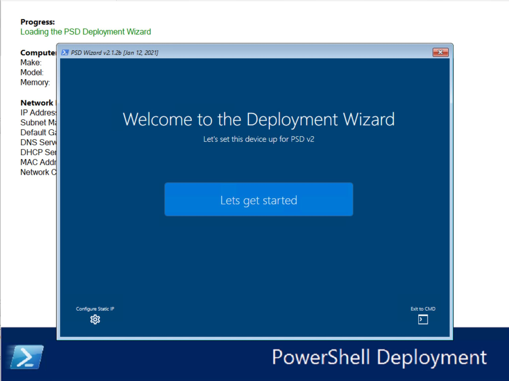
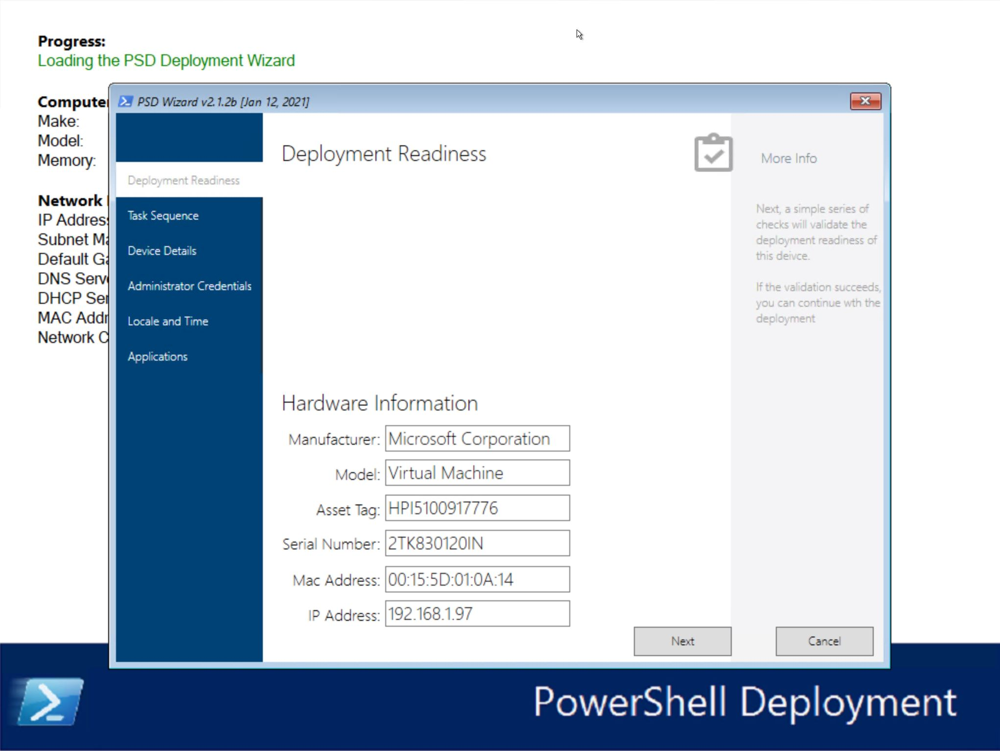
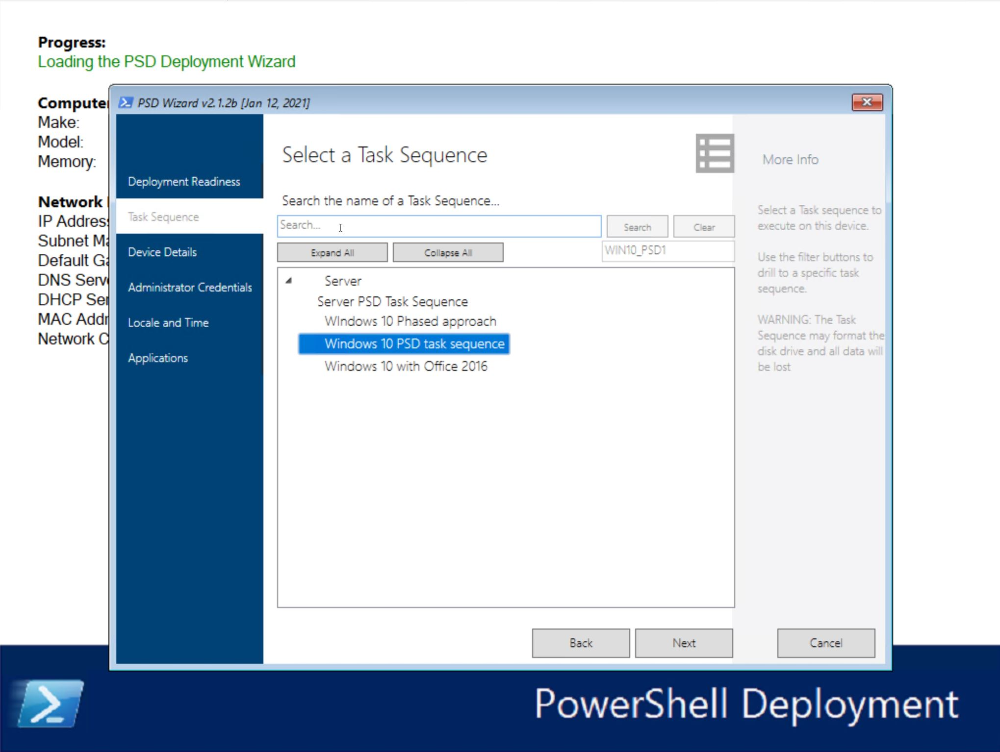
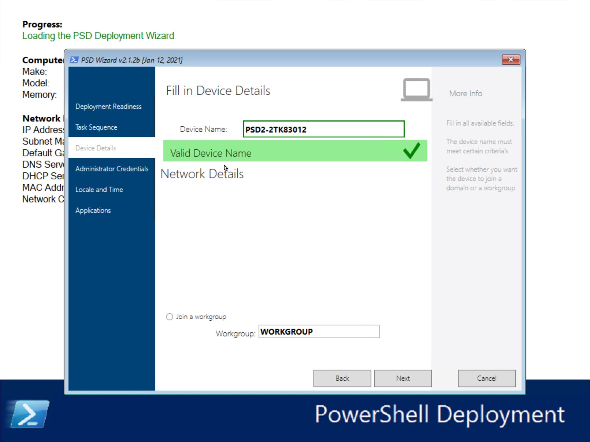
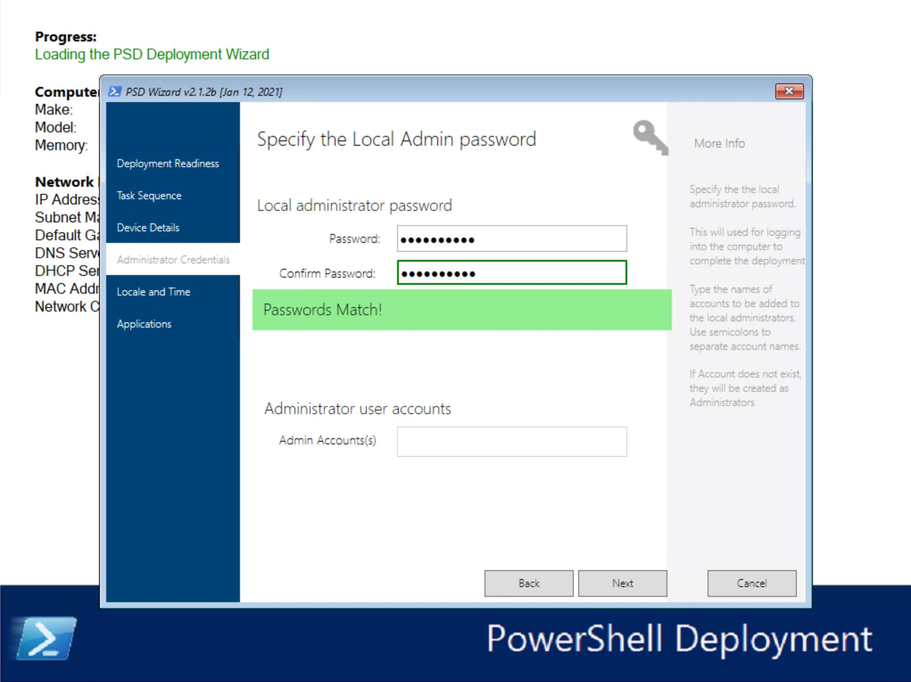
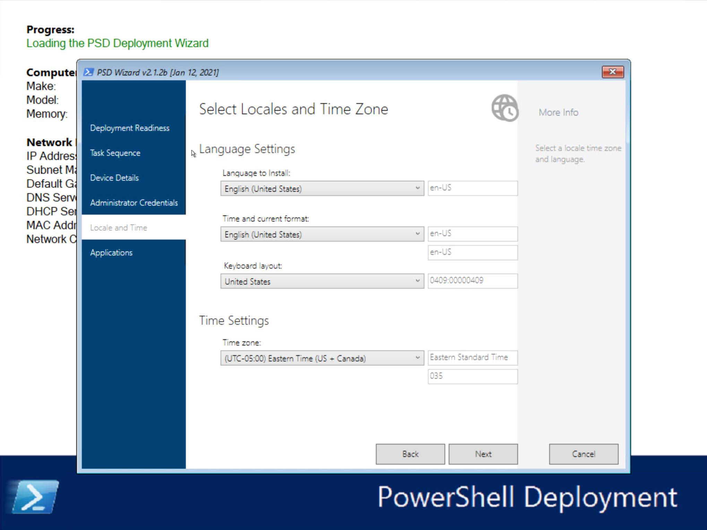
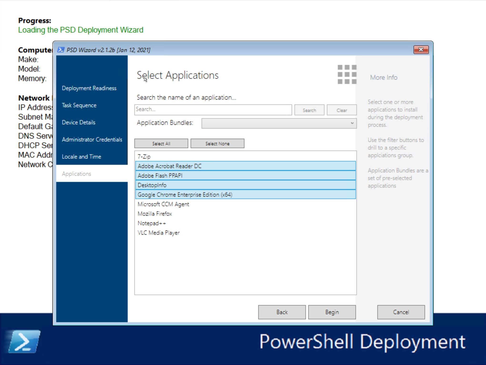
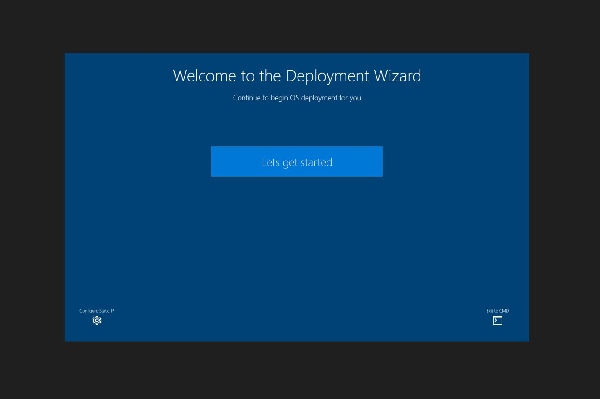
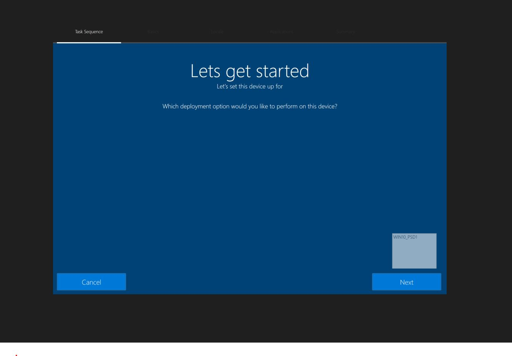

# README - PowerShell Deployment Extension Kit v2

January 2021 (ver 0.2.1.8)
  - Updates UI

October 2020 (ver 0.2.1.6)
Lots of changes.
- Upgrade works, we use it all the times
- Integration with 2Pint works better, a few issues still to solve
- Improvments on everything

June 2020 (ver 0.2.0.1)

Welcome to PowerShell Deployment (PSD)

## Target audience
- Infrastructure Architects
- Solution Architects

The purpose of PowerShell Deployment for MDT is to create a new deployment solution that provides the same level of automation as MDT but built on a more modern framework - PowerShell. The major components and functionality are built on PowerShell alone, but still leverage the MDT Workbench and layout. The goal is to support deployment shares using PSD extensions as well as legacy MDT deployment shares.

Supported deployment scenarios include deployment from the following content repositories:

  -  IIS over HTTP using WebClient (Native PS)
  -  IIS over HTTP with BITS & BranchCache using 2Pint Software's OSD Toolkit
  -  UNC (\\server\share)
 
PSD is very much a work-in-progress solution, so stay tuned as we rapidly move forward on this.

## [CHANGELOG](./Scripts/PSDWizard/CHANGELOG.MD)
## TODO:
- Themes <mark> Modern OOBE theme coming soon
- Logos/Branding
- Add deployment readiness checks
- Add refresh event handler
- build network configuration screen
- Generate XAML based on customsettings <mark> SEE CHANGELOG 11/22/2020
- Search Task Sequence <mark>  SEE CHANGELOG 11/28/2020
- Tab events <mark>  SEE CHANGELOG 11/28/2020
- Populate multilevel treeview for task sequence <mark>  SEE CHANGELOG 11/27/2020
- Search Applications <mark>  SEE CHANGELOG 11/28/2020
- SkipWizard Control <mark> SEE CHANGELOG 11/28/2020

## v2 Screenshots

- Welcome Page

  <mark>Static IP and CMD buttons do not work yet</mark>

- Readiness Page

    <mark>Planning to add prereq checks controlled by either customsettings.ini or definition.xml.

- Task Sequence Page

- Device Details Page

  <mark>Domain join will show once PSDDomainJoin.ps1 is written for it.

- Administrator Credential Page

  <mark>Additional Admin creds does not work....yet

- Locale Page

- Application Page

  <mark>Bundles are not working. working on supporting profiles as well

- Summary Page
<mark>Coming Soon

- OOBE Theme

<mark>First look

## Related References
(intentionally blank)